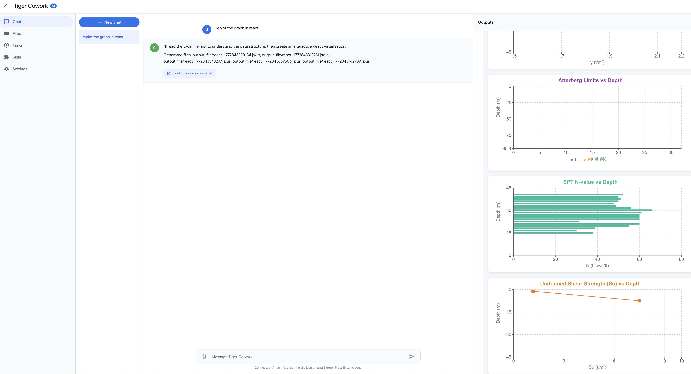

# Tiger Cowork v0.1.2

> **⚠️ WARNING: This application executes AI-generated code, shell commands, and third-party skills on your machine. Please run it inside a sandboxed environment (e.g. Docker) to protect your host system. See [Security Notice](#security-notice) below.**

A self-hosted AI-powered workspace that combines chat, file management, code execution, scheduled tasks, and a skill marketplace — all in one web interface. Compatible with any **OpenAI-compatible API** (OpenRouter, TigerBot, Ollama, etc.) with tool-calling capabilities.

## Screenshot



*AI Chat interface with tool-calling support. The AI reads data files, generates interactive React/Recharts visualizations, and renders them natively in the output panel.*


*Skills management page showing 13 installed skills from multiple sources — built-in (Claude), OpenClaw marketplace, and ClawHub community skills. Each skill can be enabled/disabled or uninstalled individually. Skills extend the AI's capabilities with specialized tools like web search, code review, data analysis, git operations, and more.*

## Architecture


The diagram above illustrates the **Tool Use & Reasoning Loop** at the core of Tiger Cowork's AI agent:

1. **User Input** — The user sends a message through the chat interface.
2. **Agent Reasoning** — The AI analyzes the query and plans which actions to take.
3. **Need Tools?** — A decision point: if the query can be answered from knowledge alone, the agent returns a **Direct Response**. If tools are needed, it proceeds to tool selection.
4. **Select Tool → Execute Tool** — The agent picks the appropriate tool (e.g. `web_search`, `run_python`, `fetch_url`, `run_react`) and executes it.
5. **Observation** — The tool result is captured and fed back into the agent's context.
6. **Update Context** — Memory and conversation context are updated with the new result.
7. **Task Done?** — Another decision point: if the task requires more information, the agent loops back to select and execute additional tools (up to 8 rounds). Once complete, it generates the final response.
8. **User Output** — The final answer, along with any generated files (charts, components, reports), is delivered to the user.

The bottom section shows all **Available Tools** organized by category — web search, URL fetching, Python/React execution, shell commands, file operations, skill management, ClawHub marketplace, and external MCP tools.

## What's New in v0.1.2

- **Context overflow fix** — Resolved "No response from API" errors after extended tool loops by truncating large tool call arguments and results, and building compact summaries for final responses
- **Improved tool loop reliability** — Added loop detection (same tool+args 3 rounds in a row), consecutive error tracking (stops after 3 failures), and automatic retry for chart/analysis generation
- **Better chart generation** — When the AI detects chart/graph/analysis requests but no output files were produced, it automatically nudges the LLM to generate them with error-aware retry
- **React component renderer** — New `ReactComponentRenderer` component for native in-browser rendering of AI-generated React/JSX components with Recharts support
- **MCP (Model Context Protocol) integration** — Connect external tool servers via Stdio, SSE, or StreamableHTTP transports; tools are auto-discovered and available to the AI
- **Robust JSON argument parsing** — Fallback parser recovers `run_python` and `run_react` code from malformed JSON tool call arguments

## Features

### AI Chat with Tool Calling
- Conversational AI assistant with automatic tool use
- 12 built-in tools: web search, URL fetch, Python execution, React rendering, shell commands, file read/write/list, skill management, and ClawHub marketplace
- Up to 8 tool rounds per conversation turn, max 12 tool calls total
- Real-time streaming of responses and tool call progress via Socket.IO
- Automatic output file generation for analysis/chart requests

### Python Execution
- Run Python code directly from chat or the dedicated Python runner
- Working directory is `output_file/` with `PROJECT_DIR` variable for accessing project files
- 60-second timeout, output truncated at 20KB stdout / 5KB stderr
- Generated files (charts, reports, CSVs) render in the output panel

### React Playground
- Generate interactive React/JSX components from chat
- Server-side JSX compilation via esbuild
- Recharts library available as globals (LineChart, BarChart, PieChart, etc.)
- Components render natively in the browser output panel via `ReactComponentRenderer`
- Import statements are auto-stripped; React hooks destructured automatically

### File Manager
- Browse, create, edit, download, and delete files in a sandboxed directory
- Built-in code editor with preview
- AI can read/write files via tool calls

### Scheduled Tasks
- Create cron-based scheduled jobs that run shell commands
- Common presets: every minute, hourly, daily, weekly
- Pause, resume, or delete tasks from the UI

### Skills & ClawHub Marketplace
- Search, install, and manage reusable AI skills from ClawHub/OpenClaw catalog
- AI can browse and install skills directly from chat
- Skills extend the AI's tool-calling capabilities via `SKILL.md` instructions

### MCP Tool Integration
- Connect external MCP servers (Stdio, SSE, StreamableHTTP)
- Auto-discovers tools from connected servers
- Tools appear alongside built-in tools for the AI to use
- Configure via Settings page; supports multiple simultaneous connections

### Web Search
- DuckDuckGo (instant answer + HTML scraping) built-in
- Optional Google Custom Search API support
- Wikipedia search as supplementary source

## Tech Stack

| Layer    | Technology                                                |
|----------|-----------------------------------------------------------|
| Frontend | React 18, React Router 6, Vite 5, Socket.IO Client 4     |
| Backend  | Node.js, Express 4, Socket.IO 4, TypeScript               |
| AI       | Any OpenAI-compatible API (OpenRouter, TigerBot, etc.)     |
| Tools    | MCP SDK 1.27, esbuild (JSX), node-cron, Python 3          |
| Data     | JSON file-based persistence (`data/` directory)            |

## Security Notice

> **⚠️ This app can execute shell commands, Python code, and install third-party skills.** For safety, it is strongly recommended to run Tiger Cowork inside a sandboxed environment such as a **Docker container**.

### Recommended: Run in Docker (Ubuntu)

```bash
docker run -it -p 3001:3001 ubuntu bash

# Inside the container:
apt-get update && apt-get install -y curl git python3 python3-pip
curl -fsSL https://deb.nodesource.com/setup_22.x | bash -
apt-get install -y nodejs

node --version

git clone https://github.com/Sompote/tiger_cowork.git
cd tiger_cowork
npm i -g clawhub
npm install && cd client && npm install && cd ..

# Set access token (recommended)
cp .env.example .env
echo 'ACCESS_TOKEN=your-secret-token' > .env

npm run dev
```

This ensures that any code execution, shell commands, or skill scripts run in an isolated environment and cannot affect your host system.

## Prerequisites

- **Node.js** >= 18
- **npm** (comes with Node.js)
- **Python 3** (optional, for Python code execution)
- **API Key** for any OpenAI-compatible provider (OpenRouter, TigerBot, Ollama, etc.)

## Installation

### 1. Clone the repository

```bash
git clone https://github.com/Sompote/tiger_cowork.git
cd tiger_cowork
```

### 2. Install dependencies

```bash
npm i -g clawhub
npm install
cd client && npm install && cd ..
```

### 3. Set up access token (optional but recommended)

Create a `.env` file to protect the app with an access token:

```bash
cp .env.example .env
```

Edit `.env` and set your token:

```env
ACCESS_TOKEN=your-secret-token-here
```

If you skip this step, the app will run without authentication (open to anyone who can reach it).

### 4. Run in development mode

```bash
npm run dev
```

The app starts at **http://localhost:3001**. If you set an access token, you'll see a login screen — enter your token to continue.

### 5. Build and run for production

```bash
npm run build
npm start
```

### 6. Running in background (production)

**Option A — Using `nohup`** (simple, no extra dependencies):

```bash
npm run build
nohup npm start > output.log 2>&1 &
```

- Logs are written to `output.log`
- The server keeps running after you close the terminal
- To stop: `kill $(lsof -t -i:3001)` or find the PID with `ps aux | grep tsx`

**Option B — Using PM2** (recommended for production):

```bash
# Install PM2 globally
npm install -g pm2

# Build and start
npm run build
pm2 start npm --name "cowork" -- start

# Useful PM2 commands
pm2 status          # Check running processes
pm2 logs cowork     # View logs
pm2 restart cowork  # Restart the app
pm2 stop cowork     # Stop the app
pm2 delete cowork   # Remove from PM2

# Auto-start on system reboot
pm2 startup
pm2 save
```

## Configuration

### API Key Setup

1. Open the app at `http://localhost:3001`
2. Navigate to **Settings** in the sidebar
3. Enter your **API Key** (any OpenAI-compatible provider)
4. Set the **API URL** — e.g. `https://openrouter.ai/api/v1` for OpenRouter
5. Choose a **Model** — e.g. `z-ai/glm-5`, `TigerBot-70B-Chat`, etc.
6. Click **Test Connection** to verify

### Access Token Protection

Tiger Cowork supports a simple access token to protect the app from unauthorized access. When enabled, users must enter the token before they can use the app.

**Setup:**

1. Create a `.env` file in the project root (or copy from `.env.example`):

```bash
cp .env.example .env
```

2. Set your access token:

```env
ACCESS_TOKEN=your-secret-token-here
```

3. Restart the server — a login screen will appear requiring the token.

**How it works:**

- All `/api/*` routes require a valid `Authorization: Bearer <token>` header
- Socket.IO connections require the token via `auth.token` in the handshake
- The client stores the token in `localStorage` after successful login
- If the token is invalid or missing, the client shows a login screen
- File downloads pass the token via `?token=` query parameter
- To **disable** auth, leave `ACCESS_TOKEN` empty or remove it from `.env`

### Environment Variables

| Variable       | Default            | Description                          |
|----------------|--------------------|--------------------------------------|
| `ACCESS_TOKEN` | *(empty)*          | Access token to protect the app (leave empty to disable) |
| `PORT`         | `3001`             | Server port                          |
| `SANDBOX_DIR`  | `.` (project root) | Directory for file manager sandbox   |
| `NODE_ENV`     | `development`      | Set to `production` for built assets |

```bash
ACCESS_TOKEN=mysecret PORT=8080 SANDBOX_DIR=/home/user/workspace npm run dev
```

### MCP Server Configuration

1. Go to **Settings** > MCP Tools
2. Add a server with a name and URL:
   - HTTP/SSE: `https://mcp-server.example.com/sse`
   - Stdio: `node /path/to/mcp-server.js`
3. Enable the server — tools are auto-discovered
4. Connected MCP tools appear as `mcp_{serverName}_{toolName}` in the AI's toolbox

## Usage Guide

### Chat with AI

1. Open the app — you land on the **Chat** page
2. Type a message and press Enter
3. The AI responds and can automatically use tools:
   - **Web search** — "Search for latest Node.js release"
   - **Code execution** — "Write a Python script to generate a sales chart"
   - **React components** — "Build a dashboard with Recharts"
   - **File operations** — "Read the contents of config.json"
   - **Shell commands** — "Install pandas with pip"
   - **Skills** — "Search ClawHub for a YouTube transcript skill"
4. Tool calls and results appear in real-time
5. Generated files (charts, reports, HTML, React components) render in the output panel

### File Manager

1. Go to the **Files** page
2. Browse the sandbox directory
3. Click a file to preview, click **Edit** to modify
4. Use **New file** to create files, download with the download button

### Scheduled Tasks

1. Go to the **Tasks** page
2. Click **New task**
3. Set name, cron schedule (use presets or custom), and shell command
4. Tasks run automatically in the background

### Skills

1. Go to the **Skills** page
2. Browse the built-in catalog or search ClawHub
3. Install skills to extend AI capabilities
4. AI can install skills from chat: "Install the duckduckgo-search skill"

## Project Structure

```
tiger_cowork/
├── server/
│   ├── index.ts                    # Express + Socket.IO + Vite dev server entry
│   ├── routes/
│   │   ├── chat.ts                 # Chat session CRUD + message API
│   │   ├── files.ts                # File manager (list, read, write, delete)
│   │   ├── tasks.ts                # Scheduled tasks CRUD
│   │   ├── skills.ts               # Skills catalog and management
│   │   ├── settings.ts             # App settings API
│   │   ├── python.ts               # Python code execution endpoint
│   │   ├── tools.ts                # Web search, URL fetch, MCP proxy
│   │   └── clawhub.ts              # ClawHub skill marketplace
│   └── services/
│       ├── tigerbot.ts             # LLM API client (chat, streaming, tool loop)
│       ├── toolbox.ts              # 12 built-in tool definitions + dispatcher
│       ├── mcp.ts                  # MCP client (connect, discover, call tools)
│       ├── socket.ts               # Real-time Socket.IO event handlers
│       ├── scheduler.ts            # Cron job scheduler (node-cron)
│       ├── data.ts                 # JSON file-based data persistence
│       ├── python.ts               # Python subprocess runner
│       ├── sandbox.ts              # Sandbox file operations
│       └── clawhub.ts              # ClawHub marketplace service
├── client/
│   ├── src/
│   │   ├── App.tsx                 # React Router setup
│   │   ├── main.tsx                # App entry point
│   │   ├── pages/                  # Chat, Files, Tasks, Skills, Settings pages
│   │   │   └── ChatPage.tsx        # Main chat interface with output panel
│   │   ├── components/
│   │   │   ├── AuthGate.tsx        # Access token login gate
│   │   │   ├── Layout.tsx          # App layout with sidebar navigation
│   │   │   └── ReactComponentRenderer.tsx  # Native React component renderer
│   │   ├── hooks/                  # useSocket custom hook
│   │   └── styles/                 # Global CSS
│   ├── package.json
│   └── vite.config.ts
├── data/                           # Auto-created JSON data storage
│   ├── settings.json               # API keys, model, MCP config
│   ├── chat_history.json           # Chat sessions and messages
│   ├── tasks.json                  # Scheduled task definitions
│   └── skills.json                 # Installed skills registry
├── output_file/                    # Generated output files (charts, reports)
├── skills/                         # Installed ClawHub skills
├── package.json
├── tsconfig.json
└── .gitignore
```

## Built-in AI Tools

| Tool             | Description                                              |
|------------------|----------------------------------------------------------|
| `web_search`     | Search via DuckDuckGo/Google/Wikipedia                   |
| `fetch_url`      | Fetch content from any URL (JSON or text)                |
| `run_python`     | Execute Python code with file output support             |
| `run_react`      | Compile and render React/JSX components with Recharts    |
| `run_shell`      | Execute shell commands (30s timeout)                     |
| `read_file`      | Read file contents (truncated at 30KB)                   |
| `write_file`     | Write or append content to files                         |
| `list_files`     | List directory contents (max 200 entries)                |
| `list_skills`    | List all installed skills (built-in + ClawHub)           |
| `load_skill`     | Load a skill's SKILL.md instructions                     |
| `clawhub_search` | Search the ClawHub skill marketplace                     |
| `clawhub_install`| Install a skill from ClawHub by slug                     |

## API Endpoints

| Method | Endpoint                           | Description                   |
|--------|------------------------------------|-------------------------------|
| POST   | `/api/auth/verify`                 | Verify access token           |
| GET    | `/api/chat/sessions`               | List all chat sessions        |
| POST   | `/api/chat/sessions`               | Create a new chat session     |
| GET    | `/api/chat/sessions/:id`           | Get session with messages     |
| DELETE | `/api/chat/sessions/:id`           | Delete a chat session         |
| PATCH  | `/api/chat/sessions/:id`           | Rename a chat session         |
| POST   | `/api/chat/sessions/:id/messages`  | Send a message                |
| GET    | `/api/files?path=`                 | List files in sandbox         |
| GET    | `/api/tasks`                       | List scheduled tasks          |
| POST   | `/api/tasks`                       | Create a scheduled task       |
| PATCH  | `/api/tasks/:id`                   | Update/toggle a task          |
| DELETE | `/api/tasks/:id`                   | Delete a task                 |
| GET    | `/api/skills`                      | List installed skills         |
| POST   | `/api/skills`                      | Install a custom skill        |
| GET    | `/api/skills/catalog`              | Browse skill catalog          |
| GET    | `/api/settings`                    | Get app settings              |
| PUT    | `/api/settings`                    | Update settings               |
| POST   | `/api/settings/test-connection`    | Test API connection           |
| POST   | `/api/python/run`                  | Execute Python code           |
| POST   | `/api/tools/web-search`            | Search the web                |
| POST   | `/api/tools/fetch`                 | Fetch a URL                   |
| GET    | `/api/clawhub/skills`              | List installed ClawHub skills |
| GET    | `/api/clawhub/search?q=`           | Search ClawHub marketplace    |
| POST   | `/api/clawhub/install`             | Install a ClawHub skill       |

## Socket.IO Events

| Event             | Direction        | Description                          |
|-------------------|------------------|--------------------------------------|
| `chat:send`       | Client → Server  | Send a chat message                  |
| `chat:chunk`      | Server → Client  | Streamed AI response chunk           |
| `chat:status`     | Server → Client  | Status update (thinking, tool call)  |
| `chat:response`   | Server → Client  | Final complete response              |
| `python:run`      | Client → Server  | Execute Python code                  |
| `python:status`   | Server → Client  | Python execution status              |
| `python:result`   | Server → Client  | Python execution result              |

## Changelog

### v0.1.2 (2026-03-08)
- Add access token authentication to protect the app (`.env` based, optional)
- Fix context overflow causing "No response from API" after tool loops
- Improve tool loop reliability with loop detection and error tracking
- Add automatic chart generation retry for analysis tasks
- Add `ReactComponentRenderer` for native React component rendering
- Add MCP (Model Context Protocol) integration with Stdio/SSE/StreamableHTTP
- Add `.gitignore` entries for `output_file/`, `input_file/`, and chat history

### v0.1.1
- Improve tool loop reliability and chart generation for analysis tasks

### v0.1.0
- Initial release: Express + Vite web app with AI chat, file manager, Python execution, scheduled tasks, skills marketplace, and web search

## License

This project is private. All rights reserved.
