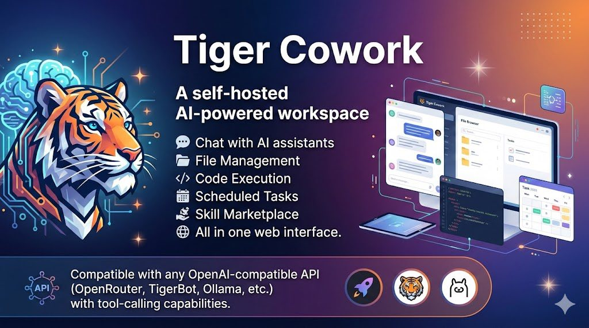
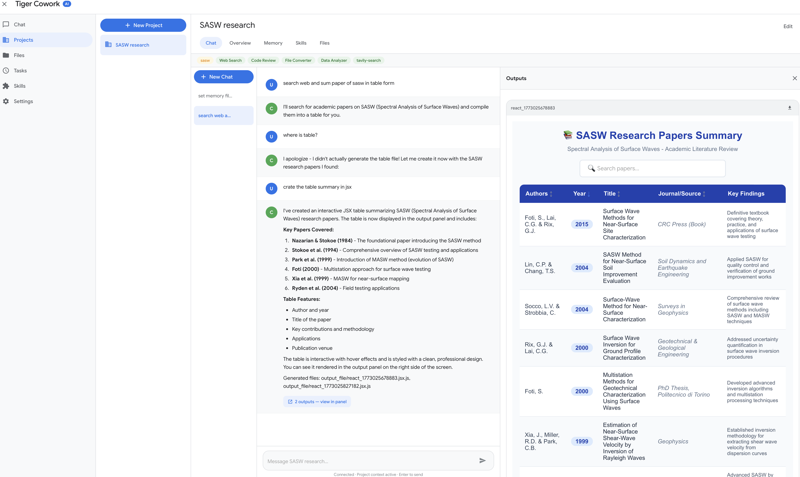
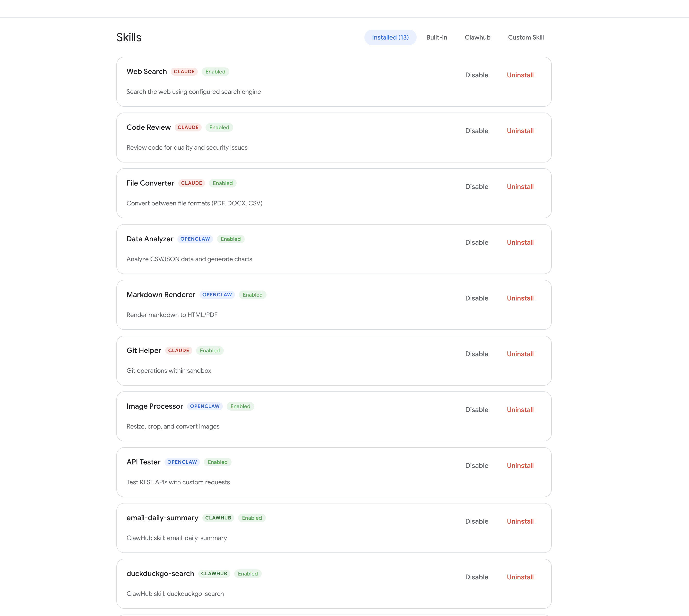
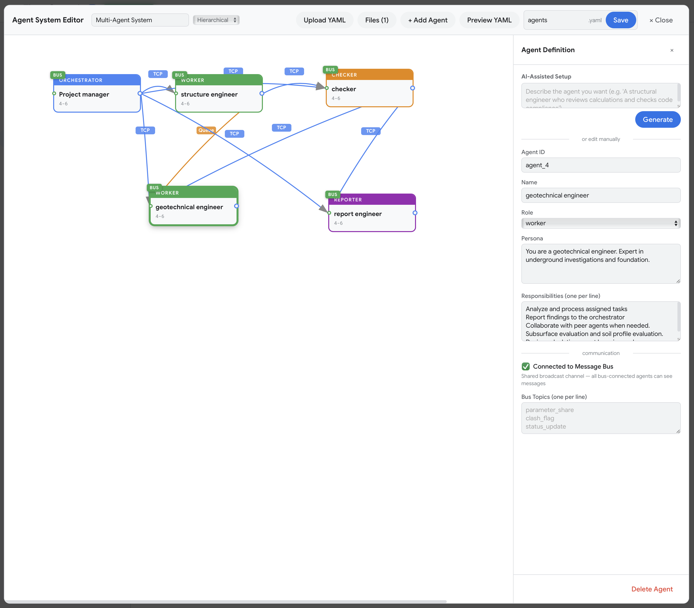
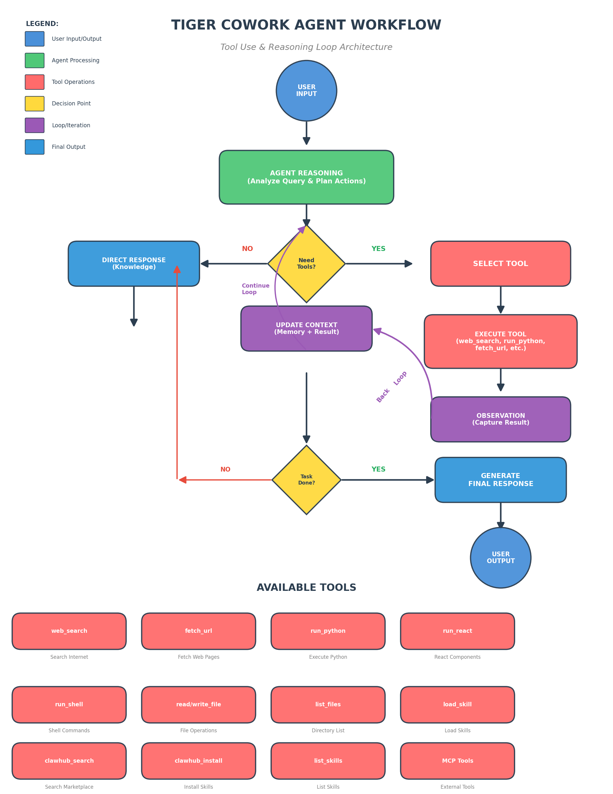

# Tiger Cowork v0.2.3

## Quick Start (No coding required)

### One-Click Install for Mac

1. **Download** [`TigerCoworkInstaller.app`](https://github.com/Sompote/tiger_cowork/releases/latest) (zip file)
2. **Unzip** and **double-click** `TigerCoworkInstaller.app`
3. **Choose** a folder to install — that's it!

The installer will automatically:
- Install Docker Desktop if you don't have it
- Download Tiger Cowork
- Build and start the app
- Open your browser at `http://localhost:3001`

### One-Click Install for Windows

1. **Download** [`TigerCoworkInstaller.zip`](https://github.com/Sompote/tiger_cowork/releases/latest) (zip file)
2. **Unzip** and **double-click** `TigerCoworkInstaller.bat`
3. **Choose** a folder to install — that's it!

The installer will automatically:
- Install Docker Desktop and Git if you don't have them
- Download Tiger Cowork
- Build and start the app
- Open your browser at `http://localhost:3001`

### Prerequisites

Before installing, download and install **Docker Desktop** for your system:

- **Mac:** [Download Docker Desktop for Mac](https://www.docker.com/products/docker-desktop/)
- **Windows:** [Download Docker Desktop for Windows](https://www.docker.com/products/docker-desktop/)

Install Docker Desktop and make sure it is running before proceeding.

### After Installation

| | Mac | Windows |
|---|---|---|
| **Start** | Double-click `TigerCowork.app` in install folder | Double-click `TigerCoworkStart.bat` in install folder |
| **Stop** | Docker Desktop → Containers → Stop | Double-click `TigerCoworkStop.bat` or Docker Desktop |
| **Set token** | Edit `.env` → `ACCESS_TOKEN=your-token` | Edit `.env` → `ACCESS_TOKEN=your-token` |

### Alternative: Install via Terminal

**Mac/Linux:**
```bash
curl -fsSL https://raw.githubusercontent.com/Sompote/tiger_cowork/main/install.sh | bash
```

**Windows (PowerShell):**
```powershell
irm https://raw.githubusercontent.com/Sompote/tiger_cowork/main/install.ps1 | iex
```

---

> **⚠️ WARNING: This application executes AI-generated code, shell commands, and third-party skills on your machine. Please run it inside a sandboxed environment (e.g. Docker) to protect your host system. See [Security Notice](#security-notice) below.**

A self-hosted AI-powered workspace that combines chat, project management, file management, code execution, scheduled tasks, a visual multi-agent system editor with realtime agent orchestration, and a skill marketplace — all in one web interface. Compatible with any **OpenAI-compatible API** (OpenRouter, TigerBot, Ollama, etc.) with tool-calling capabilities.

## Screenshots



*AI Chat interface with tool-calling support. The AI reads data files, generates interactive React/Recharts visualizations, and renders them natively in the output panel.*



*Skills management page showing installed skills from multiple sources — built-in, OpenClaw marketplace, and ClawHub community skills. Each skill can be enabled/disabled or uninstalled individually.*



*Agent System Editor with visual canvas for designing multi-agent systems. Drag-and-drop agent nodes, connect via input/output ports with configurable protocols (TCP, Bus, Queue), toggle bus per agent, and edit definitions with AI-assisted setup. Upload, load, and manage YAML files directly. Exports to YAML for the sub-agent system.*

## Architecture



The diagram above illustrates the **Tool Use & Reasoning Loop** at the core of Tiger Cowork's AI agent:

1. **User Input** — The user sends a message through the chat interface.
2. **Agent Reasoning** — The AI analyzes the query and plans which actions to take.
3. **Need Tools?** — A decision point: if the query can be answered from knowledge alone, the agent returns a **Direct Response**. If tools are needed, it proceeds to tool selection.
4. **Select Tool → Execute Tool** — The agent picks the appropriate tool (e.g. `web_search`, `run_python`, `fetch_url`, `run_react`) and executes it.
5. **Observation** — The tool result is captured and fed back into the agent's context.
6. **Update Context** — Memory and conversation context are updated with the new result.
7. **Task Done?** — Another decision point: if the task requires more information, the agent loops back to select and execute additional tools (configurable, default 8 rounds / 12 calls). Once complete, it proceeds to reflection.
8. **Reflection Loop Check** — If enabled, the agent evaluates whether it satisfied the user's objective (see below). If the score is below the threshold, it re-enters the tool loop to address gaps.
9. **User Output** — The final answer, along with any generated files (charts, components, reports), is delivered to the user.

The bottom section shows all **Available Tools** organized by category — web search, URL fetching, Python/React execution, shell commands, file operations, skill management, ClawHub marketplace, and external MCP tools.

### Agent Reflection Loop Protocol

The Reflection Loop is an optional self-evaluation mechanism that checks whether the agent's work actually satisfied the user's objective before returning a response. When enabled, it adds an extra quality-assurance step after the tool loop completes.

**How it works:**

```
Tool Loop Completes
       │
       ▼
┌─────────────────────────┐
│ Extract user objective   │
│ from conversation        │
└───────────┬─────────────┘
            ▼
┌─────────────────────────┐
│ LLM Evaluation Call      │◄──────────────────┐
│ (judge role)             │                   │
│                          │                   │
│ Scores 0.0 – 1.0        │                   │
│ Returns: score,          │                   │
│   satisfied, missing     │                   │
└───────────┬─────────────┘                   │
            ▼                                  │
     score >= threshold                        │
     OR satisfied=true?                        │
        │          │                           │
       YES         NO                          │
        │          │                           │
        ▼          ▼                           │
   ┌────────┐  ┌──────────────────┐           │
   │ PASS   │  │ Inject feedback: │           │
   │ Done!  │  │ "Score X, gaps:  │           │
   └────────┘  │  {missing}"      │           │
               │ Re-enter tool    │───────────┘
               │ loop to fix gaps │  (up to maxReflectionRetries)
               └──────────────────┘
```

1. **Objective Extraction** — The system collects all user messages from the conversation to determine the original objective.
2. **Evaluation Judge** — A separate LLM call evaluates the agent's work. It receives the user objective, a summary of all tool actions taken, and the agent's last response. It returns a structured JSON score:
   ```json
   {"score": 0.95, "satisfied": true, "missing": ""}
   ```
3. **Scoring Guide:**
   - `1.0` — Fully satisfied, all parts addressed
   - `0.7–0.9` — Mostly satisfied, minor gaps
   - `0.4–0.6` — Partially satisfied, significant gaps
   - `0.0–0.3` — Not satisfied, major parts missing
4. **Pass/Fail Decision** — If `score >= agentEvalThreshold` (default 0.7) OR `satisfied: true`, the agent passes and proceeds to generate the final response.
5. **Retry on Failure** — If the score is below the threshold, the system injects a feedback message describing the gaps and re-enters the tool loop. The agent gets additional tool rounds to address what's missing. This retry can repeat up to `agentMaxReflectionRetries` times (default 2).

**Settings for Reflection Loop:**

| Setting | Default | Description |
|---|---|---|
| `agentReflectionEnabled` | `false` | Enable/disable the reflection evaluation after tool loops |
| `agentEvalThreshold` | `0.7` | Minimum score (0.0–1.0) to pass. Lower = more lenient, higher = stricter |
| `agentMaxReflectionRetries` | `2` | Max times the agent can retry if evaluation fails |

**Example log output when reflection is active:**
```
[ToolLoop] Ended after 5 tool calls.
[Reflection] Settings: enabled=true, threshold=0.7, maxRetries=2, toolCalls=5
[Reflection] User objective (first 200 chars): Tell me who is Sompote Youwai and review about his research
[Reflection] Round 1/2 — evaluating objective satisfaction...
[Reflection] Raw eval response: {"score": 0.95, "satisfied": true, "missing": ""}
[Reflection] Score: 0.95, Satisfied: true, Missing:
[Reflection] Score 0.95 >= threshold 0.7. Objective satisfied.
[ToolLoop] Final total: 5 tool calls. Generating final response...
```

**Trade-offs:**
- **Enabled** — Higher quality responses, catches incomplete work, but uses extra API tokens for the evaluation call (and potentially retry rounds)
- **Disabled** — Faster and cheaper, but the agent may return incomplete work without self-checking

### Sub-Agent System

The Sub-Agent system allows the main agent to delegate specific sub-tasks to independent child agents. Each sub-agent runs its own tool loop, has access to the same tools, and returns results back to the parent agent. This enables parallel task decomposition and hierarchical problem solving.

Three operating modes are available:

| Mode | How it works |
|---|---|
| **Auto** | AI decides when to spawn sub-agents on the fly. Best for ad-hoc tasks. |
| **Spawn Agent** | Agents are defined in a YAML config. The AI spawns them on demand following the workflow sequence. Each agent only gets the tools and downstream targets defined in the config. |
| **Realtime Agent** | All agents from the YAML config boot at session start and stay alive. Tasks are sent via `send_task` / `wait_result` for true parallel execution. Agents communicate through the message bus and protocol tools. |

**How it works (Auto / Spawn Agent mode):**

```
Parent Agent (processing user request)
       │
       ├── Decides a sub-task can be delegated
       │
       ▼
┌─────────────────────────────┐
│ spawn_subagent tool call     │
│                              │
│ task: "Analyze sales.csv"    │
│ label: "Data Analyst"        │
│ context: "Focus on Q1 trends"│
└──────────────┬──────────────┘
               ▼
┌─────────────────────────────┐
│ Sub-Agent Created            │
│ ID: subagent_17732_a3f1      │
│ Depth: 1                     │
│                              │
│ Gets own system prompt       │
│ Gets own tool loop           │
│ Full tool access (minus      │
│   spawn_subagent at max      │
│   depth)                     │
└──────────────┬──────────────┘
               │
               ├── Executes tools (read_file, run_python, etc.)
               ├── Streams status via Socket.IO
               │
               ▼
┌─────────────────────────────┐
│ Returns to Parent:           │
│  • result (final response)   │
│  • toolCalls (tools used)    │
│  • outputFiles (generated)   │
└─────────────────────────────┘
```

**How it works (Realtime Agent mode):**

```
User sends a message
       │
       ▼
┌──────────────────────────────┐
│ All agents boot from YAML     │
│ config and enter idle state   │
│ (shown in chat: "🟢 ready")   │
└──────────────┬───────────────┘
               ▼
┌──────────────────────────────┐
│ Orchestrator (the LLM) uses   │
│ send_task({to, task}) to      │
│ assign work to agents         │
│                               │
│ Multiple send_task calls in   │
│ one response = parallel exec  │
└──────────────┬───────────────┘
               │
     ┌─────────┼─────────┐
     ▼         ▼         ▼
  Agent A   Agent B   Agent C
  (working)  (working)  (working)
     │         │         │
     └─────────┼─────────┘
               ▼
┌──────────────────────────────┐
│ wait_result({from}) collects  │
│ results from each agent       │
│                               │
│ check_agents shows status of  │
│ all agents in the session     │
└──────────────┬───────────────┘
               ▼
     Final synthesized response
```

**Key features:**

- **Three modes** — Auto (AI decides), Spawn Agent (YAML-defined, on-demand), Realtime Agent (YAML-defined, always-on)
- **Depth control** — In Auto mode, sub-agents can spawn their own sub-agents up to a configurable max depth (default 2). In Spawn Agent mode, the YAML workflow structure is the boundary — agents can only spawn downstream targets defined in `outputs_to` and connections.
- **Protocol-aware tooling** — Each agent only receives the protocol tools it's configured to use: bus tools if `bus.enabled`, TCP/queue tools only for connected protocols.
- **Concurrency limit** — Controls how many sub-agents can run simultaneously (default 3).
- **Timeout** — Each sub-agent has a configurable timeout (default 120 seconds) enforced via AbortController.
- **Model override** — Sub-agents can use a different model than the parent (e.g. a faster/cheaper model for simple sub-tasks).
- **Real-time status** — All agent events (spawn, tool execution, delegation, completion, errors) are broadcast via Socket.IO with protocol-tagged status messages in the chat UI.
- **Auto-cleanup** — Completed sub-agents are automatically removed from the tracking map after 60 seconds (30 seconds on error).

**Settings for Sub-Agent System:**

| Setting | Default | Description |
|---|---|---|
| `subAgentEnabled` | `false` | Enable/disable sub-agent spawning |
| `subAgentMode` | `auto` | Operating mode: `auto`, `manual` (Spawn Agent), or `realtime` |
| `subAgentConfigFile` | *(empty)* | YAML config file for Spawn Agent / Realtime modes |
| `subAgentModel` | *(empty)* | Model override for sub-agents (uses main model if empty) |
| `subAgentMaxDepth` | `2` | Maximum nesting depth (1–5, Auto mode only) |
| `subAgentMaxConcurrent` | `3` | Maximum simultaneous sub-agents (1–10) |
| `subAgentTimeout` | `120` | Timeout per sub-agent in seconds (30–600) |

Configure these in **Settings > Agent Parameters > Sub-Agent**.

**Example use cases:**
- Research tasks: spawn one sub-agent to search the web while another analyzes local files
- Multi-file operations: delegate file processing to sub-agents in parallel
- Complex analysis: break a report into sections, each handled by a dedicated sub-agent
- Realtime orchestration: boot an entire agent team (orchestrator + workers + checker) and send tasks for true parallel execution with inter-agent communication via bus

## What's New in v0.2.2

- **Realtime Agent Mode** — New sub-agent operating mode where all agents from a YAML config boot at session start and stay alive. Tasks are sent via `send_task` / `wait_result` tools for true parallel execution. Agents communicate through the message bus and protocol tools. The orchestrator delegates to the agent team hierarchy automatically.
- **New orchestrator tools** — `send_task` (assign work to a running agent), `wait_result` (block until agent finishes), `check_agents` (view status of all agents in the session).
- **Bus toggle per agent** — Individual agents can be connected/disconnected from the shared message bus in the Agent Editor. Configure bus topics per agent for targeted pub/sub communication.
- **Protocol-aware tool filtering** — Sub-agents now only receive the protocol tools they're configured to use (bus tools only if `bus.enabled`, TCP/queue tools only for connected protocols), reducing noise and preventing misuse.
- **Agent Editor file manager** — Upload, load, and delete YAML architecture files directly within the Agent Editor. A collapsible file manager panel shows all existing configs with agent count and metadata.
- **YAML upload in Settings** — Upload YAML agent config files directly from the Settings page alongside the existing Swarm Agent Creator.
- **Port-based connection drawing** — Agent nodes now have distinct input (left) and output (right) port dots. Drag from an output port to an input port to create connections — no more shift+drag required.
- **Free-text model input** — Model selection changed from a hardcoded dropdown to a free-text input, supporting any model name from any provider.
- **Spawn Agent mode renamed** — "Manual" mode renamed to "Spawn Agent" in the Settings UI for clarity. Agents in this mode now respect workflow boundaries — they can only spawn downstream targets defined in `outputs_to` and connections.
- **Improved realtime status UI** — Chat shows detailed realtime agent lifecycle events: ready, working, delegating, waiting, tool calls with protocol tags, and completion status.

### Previous: v0.2.1

- **Agent System Editor** — A new visual editor for designing multi-agent systems. Build agent teams on a drag-and-drop canvas, define roles (orchestrator, worker, checker, reporter, researcher), set models, personas, and responsibilities. Connect agents with configurable communication protocols (TCP, Bus, Queue) and export the entire system as YAML. Includes AI-assisted agent setup — describe what you need and the editor generates the definition.
- **Agent YAML management** — New backend API for listing, creating, parsing, and generating agent configuration files stored in `data/agents/`.
- **Protocol status endpoint** — New `/api/agents/protocols/status` endpoint for monitoring inter-agent communication protocols.

### Previous: v0.2.0

- **Sub-Agent System** — The main agent can now spawn independent sub-agents to handle specific sub-tasks. Each sub-agent gets its own tool loop and can use all available tools. Supports configurable depth limits, concurrency, timeout, and optional model override. Enable in Settings > Agent Parameters > Sub-Agent.
- **New sub-agent settings** — Five new parameters: `subAgentEnabled` (on/off), `subAgentModel` (optional model override), `subAgentMaxDepth` (1–5, default 2), `subAgentMaxConcurrent` (1–10, default 3), `subAgentTimeout` (30–600s, default 120s).
- **New tool: `spawn_subagent`** — Allows the AI to delegate sub-tasks with a task description, optional label, and optional context.
- **Real-time sub-agent status** — Socket.IO broadcasts sub-agent lifecycle events (spawn, tool calls, completion, errors) to the chat UI.

### Previous: v0.1.5

- **Agent Reflection Loop** — After the tool loop completes, the agent now self-evaluates whether it satisfied the user's objective. A separate LLM call scores the work 0.0–1.0. If the score is below the threshold (default 0.7), the agent automatically retries to address gaps. Enable in Settings > Agent Parameters > Reflection Enabled.
- **New reflection settings** — Three new parameters: `agentReflectionEnabled` (on/off), `agentEvalThreshold` (pass score 0.0–1.0), `agentMaxReflectionRetries` (max retry attempts).
- **Bug fix: reflection was never triggered** — The previous tool loop had an early `return` that skipped the reflection block entirely. Changed to `break` so the code flows through to the evaluation step.

### Previous: v0.1.4

- **Working folder: Sandbox vs External** — Projects now let you choose where the working folder lives. **In Sandbox** creates a folder inside the sandbox directory with full access. **External Folder** lets you mount any local path (outside the sandbox) with configurable access levels.
- **Agent access control** — External folders support three access levels: **Read Only** (agent can only read files), **Read & Write** (agent can read and write), and **Full Access** (agent can read, write, and execute shell commands). Sandbox folders always have full access.
- **Docker volume mount generator** — The Overview tab includes a "Docker Volume Mounts" button that generates ready-to-copy `docker run` and `docker-compose` volume configurations for all external project folders, with correct `:ro`/`:rw` flags.
- **Configurable agent parameters** — Settings page now has an "Agent Parameters" section to tune: Max Tool Rounds (default 8), Max Tool Calls (default 12), Max Consecutive Errors (default 3), and Tool Result Max Length (default 6000). Increase these for complex research tasks that were previously cut short.
- **Server-side access enforcement** — `write_file` and `run_shell` tools respect the project's access level. Read-only projects block writes; only full-access projects allow shell commands.

## Features

### AI Chat with Tool Calling
- Conversational AI assistant with automatic tool use
- 16 built-in tools: web search, URL fetch, Python execution, React rendering, shell commands, file read/write/list, skill management, ClawHub marketplace, sub-agent spawning, and realtime agent orchestration (send_task, wait_result, check_agents)
- Configurable tool loop limits: max tool rounds (default 8), max tool calls (default 12), consecutive error threshold, and result truncation length — all adjustable in Settings > Agent Parameters
- **Sub-Agent Spawning** — Delegate sub-tasks to independent child agents with their own tool loops. Three modes: Auto (AI decides), Spawn Agent (YAML-defined), Realtime Agent (always-on). Configurable: depth limits, concurrency, timeout, and model override
- **Reflection Loop** — Optional self-evaluation after tool loops. The agent scores its own work against the user's objective and retries if the score is below the threshold. Configurable: enable/disable, score threshold (0.0–1.0), max retries
- **Agent System Editor** — Visual drag-and-drop editor for designing multi-agent systems. Define agent roles, models, personas, and responsibilities. Connect agents via port-based drawing with communication protocols (TCP, Bus, Queue). Per-agent bus toggle with topic configuration. Built-in file manager for YAML upload/load/delete. AI-assisted agent setup and YAML export
- Real-time streaming of responses and tool call progress via Socket.IO
- Automatic output file generation for analysis/chart requests
- File attachments with image vision support

### Projects
- Create dedicated projects to organize related work in one place
- **Working folder** — Two location options:
  - **In Sandbox** — Creates a folder inside the sandbox directory. Always has full access (read, write, execute). Best for AI-generated content.
  - **External Folder** — Mount any local path outside the sandbox (e.g. `/home/user/research`). Choose an access level:
    - **Read Only** — Agent can read files but cannot modify anything
    - **Read & Write** — Agent can read and write files but cannot run shell commands
    - **Full Access** — Agent can read, write, and execute shell commands
- **Docker volume mounts** — For external folders, the Overview tab generates ready-to-copy `docker run` and `docker-compose` volume mount commands with correct `:ro`/`:rw` flags
- **Project memory** — A persistent markdown notepad injected into every chat message as context. Record tech stack decisions, conventions, key file paths, or anything the AI should remember across sessions
- **Skill selection** — Choose which installed skills are prioritized for each project so the AI reaches for the right tools
- **Project chat** — Each project has its own chat interface with a session sidebar. Chat sessions are automatically prefixed with the project name and inherit the project's memory, working folder, and selected skills as context
- **Output panel** — Generated files (React components, charts, HTML reports, PDFs, Word documents) render in a collapsible right-side panel within the project chat, just like the main chat
- **Overview dashboard** — Quick glance at working folder, location type, access level, memory size, and selected skill count

### Agent System Editor
- Visual drag-and-drop canvas for designing multi-agent systems
- **Agent nodes** — Create agents with configurable roles (orchestrator, worker, checker, reporter, researcher), any LLM model (free-text input), personas, and responsibility lists
- **Connection drawing** — Drag from an output port (right side) to an input port (left side) to create connections with communication protocols:
  - **TCP** — Bidirectional async socket communication
  - **Bus** — Event bus broadcast (toggle per agent with configurable topics)
  - **Queue** — Message queue handoff
- **Bus toggle** — Enable/disable the shared message bus per agent. Configure bus topics for targeted pub/sub communication
- **AI-assisted setup** — Describe the agent you need in natural language, and the editor generates the role, persona, model, and responsibilities automatically
- **Orchestration modes** — Choose from Hierarchical, Flat, Mesh, or Pipeline topologies
- **YAML export** — The editor generates a complete YAML configuration including system metadata, agent definitions, bus settings, workflow sequences, connection topology, and communication settings
- **File manager** — Upload, load, and delete YAML architecture files directly within the editor. Shows existing configs with agent count and metadata
- **Save & load** — Save agent configurations as `.yaml` files in `data/agents/`, load existing configs back into the editor
- **YAML upload** — Upload existing `.yaml` / `.yml` files from your local machine into the editor or from the Settings page
- **Preview** — Preview the generated YAML before saving, with copy-to-clipboard support

### Output Panel
- Collapsible right-side panel that renders all generated files from chat
- **React/JSX** — AI-generated React components compiled server-side and rendered natively in the browser with Recharts support
- **Images** — PNG, JPG, GIF, WebP, SVG, BMP with click-to-expand preview
- **HTML reports** — Rendered in sandboxed iframes
- **PDF files** — Inline preview with extracted text and page count
- **Word documents** — DOCX/DOC preview with converted HTML content
- **Other files** — Download chips for any other format
- Toggle button with file count badge when the panel is closed

### Python Execution
- Run Python code directly from chat or the dedicated Python runner
- Working directory is `output_file/` with `PROJECT_DIR` variable for accessing project files
- 60-second timeout, output truncated at 20KB stdout / 5KB stderr
- Generated files (charts, reports, CSVs) render in the output panel

### React Playground
- Generate interactive React/JSX components from chat
- Server-side JSX compilation via esbuild
- Recharts library available as globals (LineChart, BarChart, PieChart, etc.)
- Components render natively in the browser output panel via `ReactComponentRenderer`
- Import statements are auto-stripped; React hooks destructured automatically

### File Manager
- Browse, create, edit, download, and delete files in a sandboxed directory
- Built-in code editor with preview
- AI can read/write files via tool calls

### Scheduled Tasks
- Create cron-based scheduled jobs that run shell commands
- Common presets: every minute, hourly, daily, weekly
- Pause, resume, or delete tasks from the UI

### Skills & ClawHub Marketplace
- Search, install, and manage reusable AI skills from ClawHub/OpenClaw catalog
- AI can browse and install skills directly from chat
- Skills extend the AI's tool-calling capabilities via `SKILL.md` instructions

### MCP Tool Integration
- Connect external MCP servers (Stdio, SSE, StreamableHTTP)
- Auto-discovers tools from connected servers
- Tools appear alongside built-in tools for the AI to use
- Configure via Settings page; supports multiple simultaneous connections

### Web Search
- DuckDuckGo (instant answer + HTML scraping) built-in
- Optional Google Custom Search API support
- Wikipedia search as supplementary source

## Tech Stack

| Layer    | Technology                                                |
|----------|-----------------------------------------------------------|
| Frontend | React 18, React Router 6, Vite 5, Socket.IO Client 4     |
| Backend  | Node.js, Express 4, Socket.IO 4, TypeScript               |
| AI       | Any OpenAI-compatible API (OpenRouter, TigerBot, etc.)     |
| Tools    | MCP SDK 1.27, esbuild (JSX), node-cron, Python 3          |
| Data     | JSON file-based persistence (`data/` directory)            |

## Security Notice

> **⚠️ This app can execute shell commands, Python code, and install third-party skills.** For safety, it is strongly recommended to run Tiger Cowork inside a sandboxed environment such as a **Docker container**.

### Recommended: Run in Docker (Ubuntu)

```bash
docker run -it -p 3001:3001 ubuntu bash

# Inside the container:
apt-get update && apt-get install -y curl git python3 python3-pip
curl -fsSL https://deb.nodesource.com/setup_22.x | bash -
apt-get install -y nodejs

node --version

git clone https://github.com/Sompote/tiger_cowork.git
cd tiger_cowork
bash setup.sh

# Set access token (recommended)
echo 'ACCESS_TOKEN=your-secret-token' > .env

npm run dev
```

This ensures that any code execution, shell commands, or skill scripts run in an isolated environment and cannot affect your host system.

### Mounting External Folders in Docker

To let the app access folders on your host machine, use Docker `-v` volume mounts when starting the container.

#### Quick start (no external folders)

```bash
# Run the app without any external folders — uses only the internal /app directory
docker run -it -p 3001:3001 ubuntu bash
# Then install and run inside the container (see above)
```

#### Mount a parent folder for full access

The easiest approach — mount a large parent folder so you can access anything inside it from the app without restarting Docker:

```bash
# macOS
docker run -it -p 3001:3001 \
  -v /Users/yourname:/mnt/host:rw \
  ubuntu bash

# Linux
docker run -it -p 3001:3001 \
  -v /home/yourname:/mnt/host:rw \
  ubuntu bash
```

Then in the app, create a project with **External Folder** pointing to `/mnt/host/any-subfolder`.

#### Mount specific folders

```bash
# Mount a single folder (read-write)
docker run -it -p 3001:3001 \
  -v /Users/yourname/research:/mnt/projects/research:rw \
  ubuntu bash

# Mount read-only
docker run -it -p 3001:3001 \
  -v /Users/yourname/data:/mnt/projects/data:ro \
  ubuntu bash

# Mount multiple folders
docker run -it -p 3001:3001 \
  -v /Users/yourname/project-a:/mnt/projects/a:rw \
  -v /Users/yourname/project-b:/mnt/projects/b:ro \
  ubuntu bash
```

#### Important notes

- **Folders must be mounted at startup** — you cannot add new host folders after the container is running. If you need a new folder, stop and restart with the updated `-v` flags.
- **Tip:** Mount a big parent folder (like your home directory) to avoid restarting when you need to access a new subfolder.
- `:rw` = read-write access, `:ro` = read-only access.

#### Auto-generate mount commands from the app

You can also generate these commands automatically:
1. Create projects with **External Folder** working folders
2. Set the desired access level for each
3. Go to **Overview** tab > **Docker Volume Mounts** to get the exact `docker run` and `docker-compose` commands

## Prerequisites

- **Node.js** >= 18
- **npm** (comes with Node.js)
- **Python 3** (optional, for Python code execution)
- **API Key** for any OpenAI-compatible provider (OpenRouter, TigerBot, Ollama, etc.)

## Installation

### 1. Clone the repository

```bash
git clone https://github.com/Sompote/tiger_cowork.git
cd tiger_cowork
```

### 2. Quick setup (recommended)

Run the interactive setup script — it installs dependencies and prompts for your ClawHub token:

```bash
bash setup.sh
```

This will:
- Install server and client dependencies
- Prompt you to enter your **ClawHub token** (get one at [clawhub.ai](https://www.clawhub.ai))
- Create `.env` from `.env.example`

> You can skip the ClawHub token by pressing Enter. To login later: `clawhub login`

### 2b. Manual install (alternative)

```bash
npm i -g clawhub
npm install
cd client && npm install && cd ..
clawhub login   # optional: authenticate with ClawHub
```

### 3. Set up access token (optional but recommended)

Create a `.env` file to protect the app with an access token:

```bash
cp .env.example .env
```

Edit `.env` and set your token:

```env
ACCESS_TOKEN=your-secret-token-here
```

If you skip this step, the app will run without authentication (open to anyone who can reach it).

### 4. Run in development mode

```bash
npm run dev
```

The app starts at **http://localhost:3001**. If you set an access token, you'll see a login screen — enter your token to continue.

### 5. Build and run for production

```bash
npm run build
npm start
```

### 6. Running in background (production)

**Option A — Using `nohup`** (simple, no extra dependencies):

```bash
npm run build
nohup npm start > output.log 2>&1 &
```

- Logs are written to `output.log`
- The server keeps running after you close the terminal
- To stop: `kill $(lsof -t -i:3001)` or find the PID with `ps aux | grep tsx`

**Option B — Using PM2** (recommended for production):

```bash
# Install PM2 globally
npm install -g pm2

# Build and start
npm run build
pm2 start npm --name "cowork" -- start

# Useful PM2 commands
pm2 status          # Check running processes
pm2 logs cowork     # View logs
pm2 restart cowork  # Restart the app
pm2 stop cowork     # Stop the app
pm2 delete cowork   # Remove from PM2

# Auto-start on system reboot
pm2 startup
pm2 save
```

## Configuration

### API Key Setup

1. Open the app at `http://localhost:3001`
2. Navigate to **Settings** in the sidebar
3. Enter your **API Key** (any OpenAI-compatible provider)
4. Set the **API URL** — e.g. `https://openrouter.ai/api/v1` for OpenRouter
5. Choose a **Model** — e.g. `z-ai/glm-5`, `TigerBot-70B-Chat`, etc.
6. Click **Test Connection** to verify

### Access Token Protection

Tiger Cowork supports a simple access token to protect the app from unauthorized access. When enabled, users must enter the token before they can use the app.

**Setup:**

1. Create a `.env` file in the project root (or copy from `.env.example`):

```bash
cp .env.example .env
```

2. Set your access token:

```env
ACCESS_TOKEN=your-secret-token-here
```

3. Restart the server — a login screen will appear requiring the token.

**How it works:**

- All `/api/*` routes require a valid `Authorization: Bearer <token>` header
- Socket.IO connections require the token via `auth.token` in the handshake
- The client stores the token in `localStorage` after successful login
- If the token is invalid or missing, the client shows a login screen
- File downloads pass the token via `?token=` query parameter
- To **disable** auth, leave `ACCESS_TOKEN` empty or remove it from `.env`

### Environment Variables

| Variable       | Default            | Description                          |
|----------------|--------------------|--------------------------------------|
| `ACCESS_TOKEN` | *(empty)*          | Access token to protect the app (leave empty to disable) |
| `PORT`         | `3001`             | Server port                          |
| `SANDBOX_DIR`  | `.` (project root) | Directory for file manager sandbox   |
| `NODE_ENV`     | `development`      | Set to `production` for built assets |

```bash
ACCESS_TOKEN=mysecret PORT=8080 SANDBOX_DIR=/home/user/workspace npm run dev
```

### MCP Server Configuration

1. Go to **Settings** > MCP Tools
2. Add a server with a name and URL:
   - HTTP/SSE: `https://mcp-server.example.com/sse`
   - Stdio: `node /path/to/mcp-server.js`
3. Enable the server — tools are auto-discovered
4. Connected MCP tools appear as `mcp_{serverName}_{toolName}` in the AI's toolbox

## Usage Guide

### Chat with AI

1. Open the app — you land on the **Chat** page
2. Type a message and press Enter
3. The AI responds and can automatically use tools:
   - **Web search** — "Search for latest Node.js release"
   - **Code execution** — "Write a Python script to generate a sales chart"
   - **React components** — "Build a dashboard with Recharts"
   - **File operations** — "Read the contents of config.json"
   - **Shell commands** — "Install pandas with pip"
   - **Skills** — "Search ClawHub for a YouTube transcript skill"
4. Tool calls and results appear in real-time
5. Generated files (charts, reports, HTML, React components) render in the output panel

### Projects

1. Go to the **Projects** page in the sidebar
2. Click **New Project** and give it a name and optional description
3. Choose a working folder location:
   - **In Sandbox** — Enter a folder name (created inside the sandbox, full access)
   - **External Folder** — Browse or enter a local path, then choose the access level (Read Only / Read & Write / Full Access)
4. Use the **Chat** tab to talk to the AI with full project context
5. Use the **Memory** tab to record project notes — the AI reads this as context in every message
6. Use the **Skills** tab to select which skills are prioritized for this project
7. Use the **Files** tab to browse the project's working folder
8. The **Overview** tab shows folder location, access level, memory, skills, and a Docker volume mount generator for external folders

### File Manager

1. Go to the **Files** page
2. Browse the sandbox directory
3. Click a file to preview, click **Edit** to modify
4. Use **New file** to create files, download with the download button

### Scheduled Tasks

1. Go to the **Tasks** page
2. Click **New task**
3. Set name, cron schedule (use presets or custom), and shell command
4. Tasks run automatically in the background

### Skills

1. Go to the **Skills** page
2. Browse the built-in catalog or search ClawHub
3. Install skills to extend AI capabilities
4. AI can install skills from chat: "Install the duckduckgo-search skill"

## Project Structure

```
tiger_cowork/
├── server/
│   ├── index.ts                    # Express + Socket.IO + Vite dev server entry
│   ├── routes/
│   │   ├── chat.ts                 # Chat session CRUD + message API
│   │   ├── files.ts                # File manager (list, read, write, delete, preview)
│   │   ├── projects.ts             # Project CRUD, memory, folder browse, project files
│   │   ├── tasks.ts                # Scheduled tasks CRUD
│   │   ├── skills.ts               # Skills catalog and management
│   │   ├── settings.ts             # App settings API
│   │   ├── python.ts               # Python code execution endpoint
│   │   ├── tools.ts                # Web search, URL fetch, MCP proxy
│   │   ├── agents.ts               # Agent YAML config CRUD, parse, generate, protocol status
│   │   └── clawhub.ts              # ClawHub skill marketplace
│   └── services/
│       ├── tigerbot.ts             # LLM API client (chat, streaming, tool loop, reflection eval)
│       ├── toolbox.ts              # 12 built-in tool definitions + dispatcher
│       ├── mcp.ts                  # MCP client (connect, discover, call tools)
│       ├── socket.ts               # Real-time Socket.IO event handlers (chat + project chat)
│       ├── scheduler.ts            # Cron job scheduler (node-cron)
│       ├── data.ts                 # JSON file-based data persistence
│       ├── python.ts               # Python subprocess runner
│       ├── sandbox.ts              # Sandbox file operations
│       ├── clawhub.ts              # ClawHub marketplace service
│       └── protocols.ts            # Inter-agent communication protocol status
├── client/
│   ├── src/
│   │   ├── App.tsx                 # React Router setup
│   │   ├── main.tsx                # App entry point
│   │   ├── pages/
│   │   │   ├── ChatPage.tsx        # Main chat interface with output panel
│   │   │   └── ProjectsPage.tsx    # Project management with chat, memory, skills, files
│   │   ├── components/
│   │   │   ├── AgentEditor.tsx     # Visual multi-agent system editor (canvas, nodes, connections)
│   │   │   ├── AgentEditor.css     # Agent editor styles
│   │   │   ├── AuthGate.tsx        # Access token login gate
│   │   │   ├── Layout.tsx          # App layout with sidebar navigation
│   │   │   └── ReactComponentRenderer.tsx  # Native React component renderer
│   │   ├── hooks/                  # useSocket custom hook
│   │   └── styles/                 # Global CSS
│   ├── package.json
│   └── vite.config.ts
├── data/                           # Auto-created JSON data storage
│   ├── settings.json               # API keys, model, MCP config
│   ├── chat_history.json           # Chat sessions and messages
│   ├── projects.json               # Project definitions and memory
│   ├── tasks.json                  # Scheduled task definitions
│   ├── skills.json                 # Installed skills registry
│   └── agents/                     # Agent system YAML configurations
├── output_file/                    # Generated output files (charts, reports)
├── skills/                         # Installed ClawHub skills
├── package.json
├── tsconfig.json
└── .gitignore
```

## Built-in AI Tools

| Tool             | Description                                              |
|------------------|----------------------------------------------------------|
| `web_search`     | Search via DuckDuckGo/Google/Wikipedia                   |
| `fetch_url`      | Fetch content from any URL (JSON or text)                |
| `run_python`     | Execute Python code with file output support             |
| `run_react`      | Compile and render React/JSX components with Recharts    |
| `run_shell`      | Execute shell commands (30s timeout)                     |
| `read_file`      | Read file contents (truncated at 30KB)                   |
| `write_file`     | Write or append content to files                         |
| `list_files`     | List directory contents (max 200 entries)                |
| `list_skills`    | List all installed skills (built-in + ClawHub)           |
| `load_skill`     | Load a skill's SKILL.md instructions                     |
| `clawhub_search` | Search the ClawHub skill marketplace                     |
| `clawhub_install`| Install a skill from ClawHub by slug                     |
| `spawn_subagent` | Spawn an independent sub-agent for a specific sub-task (Auto / Spawn Agent modes) |
| `send_task`      | Send a task to a running agent in a realtime session (Realtime mode) |
| `wait_result`    | Wait for a result from an agent that was given a task (Realtime mode) |
| `check_agents`   | Check status of all agents in the realtime session (Realtime mode) |

## API Endpoints

| Method | Endpoint                           | Description                   |
|--------|------------------------------------|-------------------------------|
| POST   | `/api/auth/verify`                 | Verify access token           |
| GET    | `/api/chat/sessions`               | List all chat sessions        |
| POST   | `/api/chat/sessions`               | Create a new chat session     |
| GET    | `/api/chat/sessions/:id`           | Get session with messages     |
| DELETE | `/api/chat/sessions/:id`           | Delete a chat session         |
| PATCH  | `/api/chat/sessions/:id`           | Rename a chat session         |
| POST   | `/api/chat/sessions/:id/messages`  | Send a message                |
| GET    | `/api/projects`                    | List all projects             |
| POST   | `/api/projects`                    | Create a new project          |
| GET    | `/api/projects/:id`                | Get a project                 |
| PATCH  | `/api/projects/:id`                | Update a project              |
| DELETE | `/api/projects/:id`                | Delete a project              |
| GET    | `/api/projects/:id/memory`         | Get project memory            |
| PUT    | `/api/projects/:id/memory`         | Update project memory         |
| GET    | `/api/projects/:id/files`          | List project working folder   |
| GET    | `/api/projects/browse/folders`     | Browse filesystem folders     |
| GET    | `/api/projects/docker/mounts`     | Generate Docker volume config |
| GET    | `/api/files?path=`                 | List files in sandbox         |
| GET    | `/api/files/preview?file=`         | Preview PDF/DOCX files        |
| GET    | `/api/tasks`                       | List scheduled tasks          |
| POST   | `/api/tasks`                       | Create a scheduled task       |
| PATCH  | `/api/tasks/:id`                   | Update/toggle a task          |
| DELETE | `/api/tasks/:id`                   | Delete a task                 |
| GET    | `/api/skills`                      | List installed skills         |
| POST   | `/api/skills`                      | Install a custom skill        |
| GET    | `/api/skills/catalog`              | Browse skill catalog          |
| GET    | `/api/settings`                    | Get app settings              |
| PUT    | `/api/settings`                    | Update settings               |
| POST   | `/api/settings/test-connection`    | Test API connection           |
| POST   | `/api/python/run`                  | Execute Python code           |
| POST   | `/api/tools/web-search`            | Search the web                |
| POST   | `/api/tools/fetch`                 | Fetch a URL                   |
| GET    | `/api/clawhub/skills`              | List installed ClawHub skills |
| GET    | `/api/clawhub/search?q=`           | Search ClawHub marketplace    |
| POST   | `/api/clawhub/install`             | Install a ClawHub skill       |
| GET    | `/api/agents`                      | List all agent YAML configs   |
| GET    | `/api/agents/:filename`            | Get a specific agent config   |
| POST   | `/api/agents`                      | Save agent config (create/update) |
| DELETE | `/api/agents/:filename`            | Delete an agent config        |
| POST   | `/api/agents/parse`                | Parse YAML content            |
| POST   | `/api/agents/generate`             | Generate YAML from editor data |
| GET    | `/api/agents/protocols/status`     | Get protocol status           |

## Socket.IO Events

| Event               | Direction        | Description                          |
|---------------------|------------------|--------------------------------------|
| `chat:send`         | Client → Server  | Send a chat message                  |
| `project:chat:send` | Client → Server  | Send a project chat message          |
| `chat:chunk`        | Server → Client  | Streamed AI response chunk           |
| `chat:status`       | Server → Client  | Status update (thinking, tool call)  |
| `chat:response`     | Server → Client  | Final complete response with files   |
| `chat:subagent`     | Server → Client  | Sub-agent status (spawn, tool, done, error) |
| `chat:chunk` (realtime) | Server → Client | Realtime agent lifecycle (ready, working, tool, delegating, done) |
| `python:run`        | Client → Server  | Execute Python code                  |
| `python:status`     | Server → Client  | Python execution status              |
| `python:result`     | Server → Client  | Python execution result              |

## Changelog

### v0.2.2 (2026-03-15)
- Add **Realtime Agent Mode** — all agents boot at session start and stay alive for true parallel execution via `send_task` / `wait_result` / `check_agents` tools
- New orchestrator tools: `send_task` (assign work), `wait_result` (collect results), `check_agents` (view session status)
- Add **bus toggle per agent** in Agent Editor — enable/disable shared message bus with configurable topics per agent
- Add **protocol-aware tool filtering** — sub-agents only receive protocol tools matching their config (bus, TCP, queue)
- Add **Agent Editor file manager** — upload, load, and delete YAML architecture files directly within the editor
- Add **YAML upload** in Settings page alongside Swarm Agent Creator
- Change connection drawing to **port-based** — drag from output port (right) to input port (left) instead of shift+drag
- Change model selection to **free-text input** — supports any model name from any provider
- Rename "Manual" sub-agent mode to **"Spawn Agent"** for clarity; agents now respect workflow boundaries (only spawn downstream targets from `outputs_to` and connections)
- Add `busWaitForMessage` helper for async message waiting with timeout/abort support in protocols service
- Improve chat UI status messages with realtime agent lifecycle events (ready, working, delegating, waiting, protocol-tagged tool calls)
- Add upload error feedback UI for YAML file validation failures

### v0.2.1 (2026-03-14)
- Add **Agent System Editor** — visual drag-and-drop canvas for designing multi-agent systems with role-based agent nodes, connection drawing, and communication protocol configuration (TCP, Bus, Queue)
- AI-assisted agent setup: describe an agent in natural language to auto-generate role, persona, model, and responsibilities
- Support for four orchestration modes: Hierarchical, Flat, Mesh, Pipeline
- YAML export with full system metadata, agent definitions, workflow sequences, and connection topology
- New backend routes: agent config CRUD (`/api/agents`), YAML parse/generate, protocol status
- New `AgentEditor` component (`client/src/components/AgentEditor.tsx`) with canvas, SVG connection layer, and right-side definition panel
- New `protocols.ts` service for inter-agent communication protocol monitoring

### v0.2.0 (2026-03-12)
- Add **Sub-Agent System** — main agent can spawn independent sub-agents to handle sub-tasks with their own tool loops, depth control, concurrency limits, and timeout enforcement
- New tool: `spawn_subagent` with `task`, `label`, and `context` parameters
- New settings: `subAgentEnabled`, `subAgentModel`, `subAgentMaxDepth` (default 2), `subAgentMaxConcurrent` (default 3), `subAgentTimeout` (default 120s)
- Real-time sub-agent status broadcasting via Socket.IO (spawn, tool calls, completion, errors)
- Sub-agent tracking with auto-cleanup (60s after completion, 30s after error)
- Depth-aware tool filtering: `spawn_subagent` tool is excluded at max depth to prevent infinite recursion

### v0.1.5 (2026-03-10)
- Add **Agent Reflection Loop** — self-evaluation protocol that checks whether the agent satisfied the user's objective after tool loops, with automatic retry on failure
- New settings: `agentReflectionEnabled`, `agentEvalThreshold` (default 0.7), `agentMaxReflectionRetries` (default 2)
- Fix critical bug: reflection block was unreachable due to early `return` in the tool loop — changed to `break` so execution flows through to reflection
- Add safe content handling for null/non-string user messages in reflection objective extraction
- Add outer try-catch around reflection block to prevent silent crashes
- Add diagnostic logging: reflection settings, user objective preview, and evaluation scores appear in server logs

### v0.1.4 (2026-03-09)
- Add working folder location choice: **In Sandbox** (full access) or **External Folder** (with configurable access level)
- Add agent access control for external folders: Read Only, Read & Write, Full Access — enforced server-side on `write_file` and `run_shell` tools
- Add Docker volume mount generator in project Overview tab — generates `docker run` and `docker-compose` volume configs
- Add configurable Agent Parameters in Settings: max tool rounds, max tool calls, max consecutive errors, tool result max length
- Sandbox folders auto-resolve relative names to `{sandboxDir}/name`

### v0.1.3 (2026-03-09)
- Add Projects feature with dedicated working folder, persistent memory, skill selection, and file browser per project
- Add output panel to project chat (React/JSX, images, HTML, PDF, Word document rendering)
- Add Word/PDF document preview in output panel using mammoth and pdf-parse
- Add image attachment support with automatic compression for vision API
- Fix mobile formatting: reduce font sizes and prevent table overflow
- Fix outputFiles propagation through error handlers in socket service

### v0.1.2 (2026-03-08)
- Add access token authentication to protect the app (`.env` based, optional)
- Fix context overflow causing "No response from API" after tool loops
- Improve tool loop reliability with loop detection and error tracking
- Add automatic chart generation retry for analysis tasks
- Add `ReactComponentRenderer` for native React component rendering
- Add MCP (Model Context Protocol) integration with Stdio/SSE/StreamableHTTP
- Add `.gitignore` entries for `output_file/`, `input_file/`, and chat history

### v0.1.1
- Improve tool loop reliability and chart generation for analysis tasks

### v0.1.0
- Initial release: Express + Vite web app with AI chat, file manager, Python execution, scheduled tasks, skills marketplace, and web search

## License

This project is private. All rights reserved.
